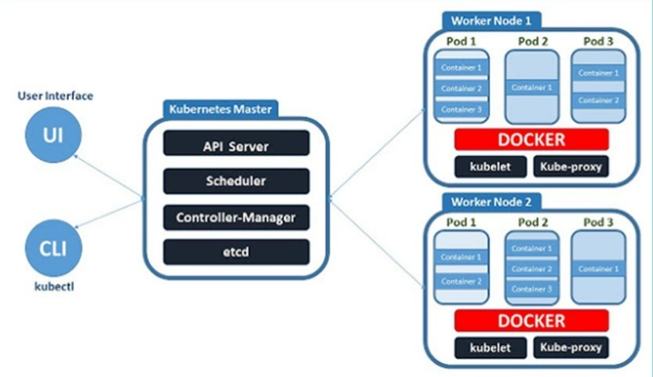

# 0.쿠버네틱스 강의
- Azure 서버와 도커 세팅 이후 시작

## **What is Kubernetes** 

### 1. Basic concept
### 2. CTL interface
### 3. yaml file
- 데이터 직렬화(serialization)에 쓰이는 양식 중 하나 
    - 데이터 직렬화는?
        > 서비스간에 data를 전송할 때 쓰이는 포맷으로 변환하는 작업<br>
        쿠버네티스는 마스터에게 요청을 보낼 때, 사용(일종의 설계 도면으로 사용)

- YAML 파일의 특성
> 사람이 읽기 쉽도록 디자인 <br>
```
apiVersion: v1 
kind: Pod 
metadata: 
  name: example 
spec: 
  containers: 
    - name: busybox 
      image: busybox:1.25 

```
- 기본적으로 key-value로 조합 
- multi document yaml 
> 하나의 yaml 파일에 --- 로 구분선을 넣으면 다른 파일로 인식한다. 


### Install MiniKube
- VM 스펙 
> VM 스펙 업그레이드 필요 <br>CPU : multicore 
<br>cpu 3개 이상 <br>Disk: 40 GB 이상 
 
- Install by command line 
```
curl -LO https://storage.googleapis.com/minikube/releases/v1.22.0/minikube-linux-amd64 

sudo install minikube-linux-amd64 /usr/local/bin/minikube

#정상다운로드 확인
minikube --help 
```
### Install Kubectl

- kubectl 은 kubernetes cluster (server) 에 요청을 간편하게 보내기 위해서 널리 사용되는 client 툴입니다. 
```
curl -LO https://dl.k8s.io/release/v1.22.1/bin/linux/amd64/kubectl 

#kubectl 바이너리를 사용할 수 있도록 권한과 위치를 변경합니다
sudo install -o root -g root -m 0755 kubectl /usr/local/bin/kubectl

kubectl --help
```

### Minikube start
- minikube 를 docker driver 를 기반으로 하여 시작합니다. 
minikube start --driver=docker 

```
sudo minikube start --driver=docker

#실행 오류날 시에 
 id $USER 
# docker 그룹이 있는지 확인 없으면 
    #그룹에 추가 
    sudo usermod -aG docker $USER
    newgrp docker
    id $USER


# 있으면
sudo systemctl restart docker

#하고 도커 접근 확인
docker run hello-world

#Restart Minikube:
minikube start --driver=docker

#정상 실행 확인 
minikube status

```  

### 실습

```
# 쿠버네티스 시스템 자체도 도커로 만들어져서 kube-system의 pod 목록을 가져왔을 때, 쿠버시스템을 구성하고 있는 컨테이너들이 나온다 
kubectl get pod -n kube-system

# kube 중단 
minikube delete

```
### Pod 개념 
- pod 생성
```
# pod 작성
vi pod.yml

#작성 내용 확인
cat pod.yml

# kubectl에게 명령을 주면 ctl이 마스터에게 요청
kubectl apply -f pod.yml 

# pod 목록 확인 
kubectl get pod
kubectl get pod -o wide # Ip 등 다양한 옵션 나옴
kubectl get pod -o yaml  # yaml 파일 형식으로 옵션들이 나옴 

# yaml 으로 꺼내기 
kubectl get pod -o yaml --> a.yaml

# pod 상태 모니터링하기
kubectl get pod -w

# "counter" pod log 찍기 
kubectl logs counter
kubectl logs counter -f

# 컨테이너 직접 들어가기 
kubectl exec -it <pod_name> -c <container_name> <명령어>

# pod 삭제 명령 
kubectl delete pod <pod_name> 
kubectl delete -f <YAML-file 경로>

```


### Deployment ?? 
- pod 와 Replicaset에 대한 관리를 제공하는 단위 
- 관리라는 의미는 self-healing scaling rollout과 같은 기능을 포함합니다.
- pod를 감싼 개념

### Deployment 생성
``` 
# yaml 파일로 생성
vi deployment.yaml

#적용 
kubectl apply -f deployment.yaml

#확인
kubectl get deployment

# scale 
kubectl scale deployment/nginx-deployment --replicas=5 
 

kubectl get deployment 
 


kubectl get pod 
# deploy ment 삭제 
kubectl delete deployment <deployment-name> 
 

kubectl get deployment 
 

kubectl get pod 
 
```
### service 
- 서비스는 쿠버네티스에 배포한 애플리케이션(pod)를 외부에서 접근하기 쉽게 추상화한 리소스
- 기존 pod는 내부 ip를 할당받고 생성되지만, 언제든지 죽었다가 다시 살아나기 때문에 ip는 그 과정에서 재할당된다. 이를 외부에서 쉽게 접근하기 위해서 ip로 접근하는 대신에 service를 통해서 접근하는 방법
```
kubectl get pod -o wide 
# Pod 의 IP 를 확인합니다. 
 

curl -X GET <POD-IP> -vvv 
ping <POD-IP> 
# 통신 불가능 
 

할당된 <POD-IP> 는 클러스터 내부에서만 접근할 수 있는 IP 이기 때문에 외부에서는 Pod 에 접속할 수 없습니다. 

minikube 내부로 접속하면 통신이 되는지 확인해보겠습니다. 

minikube ssh 
# minikube 내부로 접속합니다. 
 

curl -X GET <POD-IP> -vvv 
ping <POD-IP> 
# 통신 가능 
```
### Service로 위에 한 것처럼 길 뚫어주기 
```
vi service.yaml 

kubectl apply -f service.yaml 
 

kubectl get service 
# PORT 80:<PORT> 숫자 확인 
 

curl -X GET $(minikube ip):<PORT> 
# 이렇게 서비스를 통해서 클러스터 외부에서도 정상적으로 pod 에 접속할 수 있는 것을 확인합니다.

```